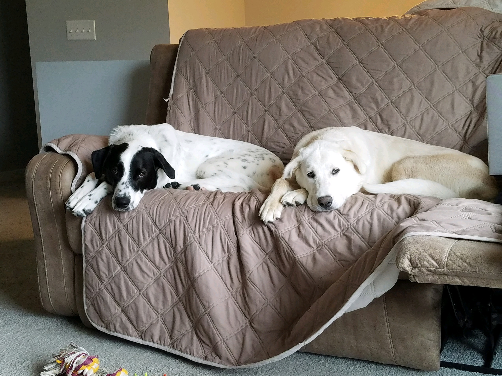

<!DOCTYPE html>
<html lang="en">

<head>
	<meta charset="UTF-8">
	<title>Sam and Lola</title>
	<link href="styles.css" rel="stylesheet">
</head
<body>
 
 
<h1>Sam and Lola - the best dogs in the world</h1>
 
 
	<section>
		
		 
		

		These two handsome dogs are Sam and Lola. They are both <a href="great_pyrenees.html">Great Pyrenees</a> mixes that weigh over 75 lbs. Sam and Lola have been a continual blessing in my life... at least once they got potty trained. They like to wrestle with each other and knock stuff over in my living room! There is never a dull moment with these two dogs in my house.
		

		

		In conclusion, my dogs are:
		<li>Large</li>
		<li>Entertaining</li>
		<li>Cute</li>
		Basically the best dogs in the world
		

	</section>
</body>
</html>
